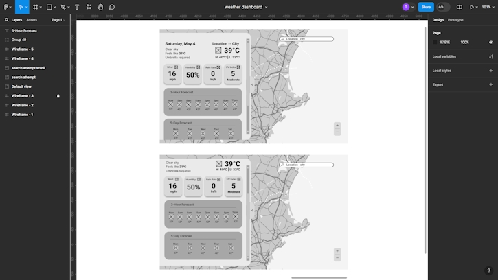
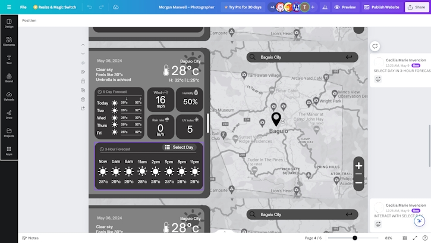

# MMSU-CS113-Project

A desktop weather-forecast app made with Java Swing.

	

## Designs

The original wireframes (including earlier revisions) designed by **@Cesshi** & **@geilala** can be found at:

- https://www.figma.com/design/Ub9InMhVFShxhxw5wkYUei/weather-dashboard
- https://www.canva.com/design/DAGEpcDlNYc/aUzd6bg1FgwD013qJSdBmA/

	

	

## Development

To start developing with this project, the following must be installed:

- **Java 8 Development Kit**. Download one from https://adoptium.net/temurin
- **Maven**. Download from https://maven.apache.org

Update your system environment variables (1) `JAVA_HOME` to the **JDK 8** folderpath and (2) `Path` to include the folderpath for the **Maven** binaries.

Afterwards, run `mvn package` to install all dependencies, compile the source, and build the executable `.jar` file of this project.

For coding style & format, the project uses the default eclipse formatter settings and you can run `mvn formatter:format` to format the codebase.

## Contributors

In alphabetical order:

- [Cecilia Invencion](https://github.com/Cesshi) (**@Cesshi**)
- [Geila Rigayen](https://github.com/geilala) (**@geilala**)
- [Lois Concepcion](https://github.com/LoisDub) (**@LoisDub** & **@LoisChiles**)
- [Theone Eclarin](https://github.com/daawaan4U) (**@daawaan4U**)
